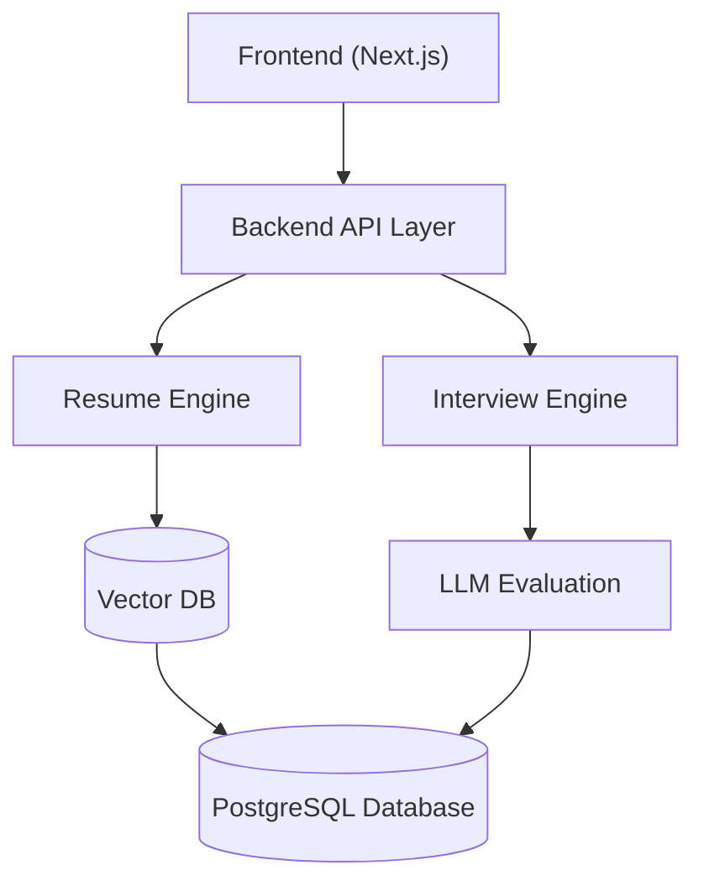

# TalentIQ AI - AI-Powered Interview and Resume Screening Platform

## 1. Project Overview

### Problem Statement
Organizations spend significant time and money screening resumes, conducting interviews, and evaluating candidates manually. Current hiring systems are slow, inconsistent, and heavily dependent on human bias.

### Solution
Build an AI-powered hiring intelligence platform that helps recruiters:
- Automatically rank resumes against job descriptions
- Conduct AI-assisted interviews
- Generate candidate evaluation reports
- Improve hiring efficiency and consistency

### MVP Goal
The goal of the hackathon MVP is to demonstrate:
- ✅ AI-based resume screening
- ✅ AI-driven interview evaluation
- ✅ Recruiter analytics dashboard
- ✅ Intelligent candidate scoring
- ✅ Enterprise-ready workflow

### Target Users
- **Primary Users**: HR recruiters, Hiring managers, Talent acquisition teams
- **Secondary Users**: Recruitment agencies, Startup founders, Campus hiring teams

---

## 2. Core MVP Features & User Flow

### Feature 1: Job Description Upload
- **Description**: Recruiter uploads a job description.
- **Inputs**: PDF / Text JD, Required skills, Experience level
- **Outputs**: Structured job requirement object
- **AI Tasks**: Extract skills, Identify role seniority, Generate evaluation criteria

### Feature 2: Resume Intelligence Engine
- **Description**: Recruiter uploads candidate resumes (PDF, DOCX).
- **AI Capabilities**: Resume parsing, Skill extraction, Experience analysis, JD matching, Candidate ranking.
- **Output**: Match score, Strengths, Weaknesses, Recommendation summary.
- **Example**:
  ```json
  {
    "candidate": "John Doe",
    "matchScore": 87,
    "skillsMatched": ["React", "Node.js", "AWS"],
    "missingSkills": ["Kubernetes"],
    "recommendation": "Strong fit for Full Stack Engineer role"
  }
  ```

### Feature 3: AI Interview Assistant
- **Description**: Candidate attends AI-powered interview (Text/Voice).
- **AI Capabilities**: Dynamic question generation, Technical/Behavioral questioning, Follow-up questioning.
- **Sample Flow**: 
  1. AI asks React question -> 2. Candidate answers -> 3. AI evaluates depth -> 4. AI asks deeper follow-up.

### Feature 4: Candidate Evaluation Engine
- **Description**: AI evaluates candidate responses based on technical knowledge, communication clarity, confidence, and problem-solving.
- **Output**: AI-generated evaluation report.
- **Example**:
  ```json
  {
    "technicalScore": 8.5,
    "communicationScore": 7.8,
    "problemSolving": 8.2,
    "recommendation": "Proceed to final round"
  }
  ```

### Feature 5: Recruiter Dashboard
- **Components**: Candidate rankings, Match scores, Interview summaries, Skill heatmaps.
- **Charts**: Top candidates, Skill distribution, Hiring funnel.

### MVP User Flow
1. **Recruiter**: Logs in -> Uploads JD -> Uploads resumes -> Reviews rankings.
2. **Interview**: Recruiter initiates AI interview -> Candidate completes it.
3. **Evaluation**: Recruiter reviews AI reports -> Shortlists candidates.

---

## 3. AI Intelligence Layer

### Resume Matching AI
- **Functionality**: Extract semantic meaning from resumes, compare against JD embeddings, and rank based on contextual matching.
- **Suggested Models**: OpenAI Embeddings, Sentence Transformers.

### Interview Intelligence AI
- **Functionality**: Generate contextual interview questions, evaluate answers using LLM, and detect weak/confident responses.
- **Suggested Models**: GPT-4o, Claude, Gemini.

### Explainable AI
- **Functionality**: AI provides reasoning for candidate selection/rejection and identifies missing skills.

---

## 4. Technical Specifications

### Tech Stack
- **Frontend**: Next.js, React.js, Tailwind CSS
- **Backend**: Node.js + Express (or Spring Boot)
- **AI Layer**: OpenAI API, LangChain
- **Database**: PostgreSQL
- **Vector DB**: Pinecone / ChromaDB
- **Processing**: PDF Parser, OCR

### System Architecture


### Database Design (Schema)
- **Users**: id (UUID), name, email, role
- **Jobs**: id (UUID), title, description, skills (JSON)
- **Candidates**: id (UUID), name, email, resumeUrl
- **Interviews**: id (UUID), candidateId, score, summary

### API Reference (Suggested)
- `POST /upload-jd`: Upload job description.
- `POST /upload-resume`: Upload candidate resume.
- `POST /generate-interview`: Generate AI interview questions.
- `POST /evaluate-answer`: Evaluate candidate response.
- `GET /candidate-ranking`: Fetch ranked candidates.

---

## 5. Project Execution & Hackathon Plan

### Timeline (24–48 Hours)
- **Phase 1: Setup (2-3h)**: Repo, DB schema, UI boilerplate.
- **Phase 2: Resume Engine (6h)**: Upload, Parsing, AI scoring.
- **Phase 3: Interview Engine (6h)**: Question generation, Answer evaluation.
- **Phase 4: Dashboard (5h)**: Recruiter UI, Rankings, Analytics.
- **Phase 5: Polish & Demo (4h)**: Bug fixes, Demo data, Presentation prep.

### Recommended Team Split
- **Frontend**: Dashboard, Candidate UI, Recruiter workflows.
- **Backend**: APIs, Authentication, Resume pipeline.
- **AI Engineer**: Prompt engineering, Scoring logic, LLM integration.

### Demo Scenario
1. Upload Full Stack Engineer JD.
2. Upload 5 candidate resumes -> AI ranks them.
3. Open profile -> Run AI interview simulation.
4. Show evaluation dashboard -> AI recommends best candidate.

### Success Metrics
- Resume ranking accuracy & AI evaluation quality.
- Recruiter usability & end-to-end demo completion.

### Final Deliverables
- Working MVP, GitHub repo, Demo presentation, Architecture diagram, Sample resumes/JDs.

---

## 6. Business Strategy & Future Vision

### Commercial Potential
- **Revenue Model**: SaaS subscription, Per-interview pricing, Enterprise license.
- **Target Customers**: IT companies, Staffing firms, Startups.

### Competitive Advantages
- AI-first workflow, Explainable scoring, Dynamic interviews, Enterprise-focused UX.

### Stretch Goals
- Voice interviews, Emotion analysis, Cheating detection, Bias reduction, Live coding.

### Future Roadmap
- **Phase 2**: Enterprise ATS integration (Slack/Teams), Calendar scheduling.
- **Phase 3**: Predictive hiring analytics, Employee retention prediction, AI interviewer copilot.

### Conclusion
TalentIQ AI modernizes recruitment with AI-powered screening and evaluation. This MVP demonstrates real business value, strong AI capabilities, and scalable SaaS potential.